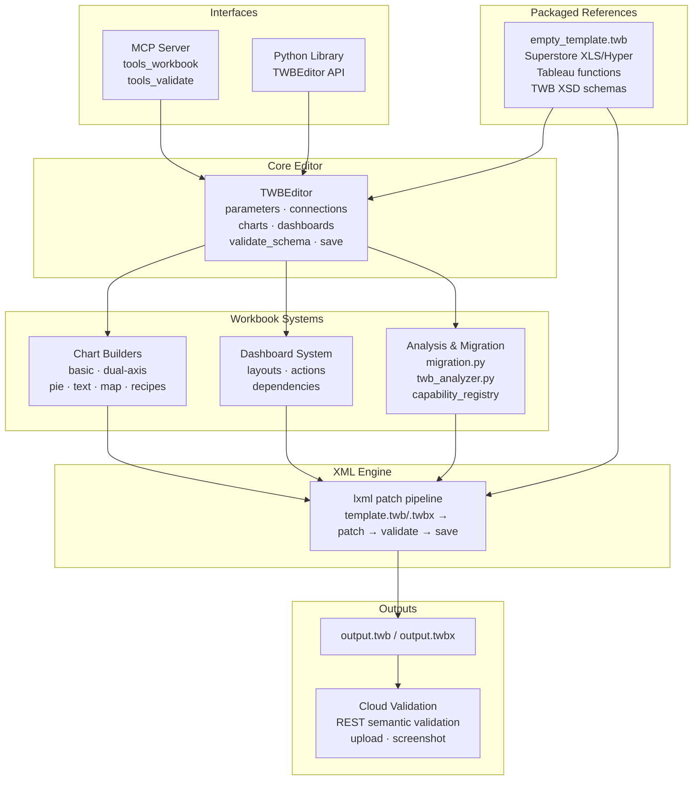

# cwtwb

<p align="center">
  
</p>

> 面向可复现 `.twb` / `.twbx` 生成、验证与迁移的 Tableau 工作簿工程层。

<p align="center">
  
</p>

**cwtwb** 是一个 Python 工具包和 Model Context Protocol（MCP）服务器，用来通过代码或 Agent 工具调用构建 Tableau Desktop 工作簿。

它的定位是 **workbook engineering layer**，不是对话式分析 Agent。重点是可复现、可检查，以及在本地工作流、脚本和 CI 中安全自动化。

`cwtwb` 中的 `cw` 来自 `Cooper Wenhua`。

**作者：** Cooper Wenhua &lt;imgwho@gmail.com&gt;

[Website](https://datacooper.com) · [Source](https://github.com/imgwho/cwtwb) · [Changelog](https://github.com/imgwho/cwtwb/blob/main/CHANGELOG.md)

[](https://pepy.tech/projects/cwtwb)
[](https://datacooper.com)
[](https://github.com/imgwho/cwtwb)
[](https://github.com/imgwho/cwtwb/blob/main/LICENSE)
[](https://www.python.org/)

## Star History

<a href="https://www.star-history.com/?type=date&repos=imgwho%2Fcwtwb">
 <picture>
   <source media="(prefers-color-scheme: dark)" srcset="https://api.star-history.com/chart?repos=imgwho/cwtwb&type=date&theme=dark&legend=top-left&sealed_token=xm3jy3j2engEOCmBiEq5NWoEpLFpz2tk_AiGAm3CuirRz2JBRu-JvFCus44LiKs419FJajjTqMGzab8aq8NoxqyD92N90PEWJZBQTDsLsskdS_Zcmbimjw" />
   <source media="(prefers-color-scheme: light)" srcset="https://api.star-history.com/chart?repos=imgwho/cwtwb&type=date&legend=top-left&sealed_token=xm3jy3j2engEOCmBiEq5NWoEpLFpz2tk_AiGAm3CuirRz2JBRu-JvFCus44LiKs419FJajjTqMGzab8aq8NoxqyD92N90PEWJZBQTDsLsskdS_Zcmbimjw" />
   
 </picture>
</a>

[试用示例工作流](examples/scripts/demo_all_supported_charts.py) · [阅读中文指南](docs/guide.zh-CN.md) · [Read the guide](https://github.com/imgwho/cwtwb/blob/main/docs/guide.md)

## 快速开始

### 安装

```bash
pip install cwtwb
```

如果需要内置的 Hyper 示例：

```bash
pip install "cwtwb[examples]"
```

如果需要云端验证（上传到 Tableau Cloud/Server）：

```bash
pip install "cwtwb[validate]"
```

### 作为 MCP Server 运行

```bash
uvx cwtwb
```

上面的短命令是最简单的默认配置。`cwtwb` 是智能入口：在交互式终端中不带参数运行时会打印 CLI 帮助；由 MCP 客户端通过 stdio 启动时会进入服务器模式。

把同一个命令加入你的 MCP 客户端配置：

```json
{
  "mcpServers": {
    "cwtwb": {
      "command": "uvx",
      "args": ["cwtwb"]
    }
  }
}
```

Claude Code：

```bash
claude mcp add cwtwb -- uvx cwtwb
```

VSCode 中可以在 workspace 或 user `mcp.json` 中添加 `cwtwb`，命令使用 `uvx cwtwb`。

如果你偏好显式脚本名，这些启动方式也等价：

```bash
uvx cwtwb mcp
uvx --from cwtwb cwtwb-mcp
python -m cwtwb.mcp_server
```

### 作为 CLI 使用

同一个包也提供面向人工、脚本、CI 和 Agent 的命令行工作流，适合需要直接操作文件而不是 MCP 工具调用的场景。

```bash
cwtwb --help
cwtwb doctor
cwtwb status --json
cwtwb inspect workbook.twb --json
cwtwb validate workbook.twb
cwtwb analyze workbook.twb --json
cwtwb run examples/specs/basic_cli.yaml
```

常见写入命令默认要求显式输出路径：

```bash
cwtwb create --out output/base.twb
cwtwb chart add output/base.twb --worksheet "Sales by Category" --mark Bar --rows Category --columns "SUM(Sales)" --out output/chart.twb
cwtwb dashboard add output/chart.twb --name Overview --worksheets "Sales by Category" --out output/dashboard.twb
```

只有当你明确想覆盖输入工作簿时才使用 `--in-place`；只有在确认要替换已有输出文件时才使用 `--force`。

### MCP 客户端稳定性

当 cwtwb 作为 MCP server 连接时，Agent 应该通过客户端暴露的 MCP 工具直接调用。不要运行 `mcp call cwtwb ...`、`mcp list-tools cwtwb`、`gh api .../mcp/...` 之类 shell 命令；这些命令不属于 cwtwb，在正常 Claude、Codex、Cursor 或 VSCode 环境里通常不可用。

如果 Agent 看不到 `create_workbook`、`add_worksheet`、`save_workbook` 等工具，应重启或重新连接 MCP 客户端，并检查 server 配置。清理 `uv` 缓存只会刷新安装包，不会修复客户端里过期的工具列表。

对 Agent 有用的资源：

```text
cwtwb://tool-surface
cwtwb://skills/index
cwtwb://skills/dashboard_designer
file://docs/tableau_all_functions.json
```

也提供了兼容别名，例如 `cwtwb://docs/manual-editing`。新 prompt 应优先使用 `cwtwb://tool-surface` 和 `cwtwb://skills/index`。

完整参考见 [中文指南](docs/guide.zh-CN.md) 或 [英文指南](https://github.com/imgwho/cwtwb/blob/main/docs/guide.md)。

### Dashboard Layout 文件

自定义 dashboard layout 可以用 JSON 或 YAML 编写，两者使用同一套声明式 DSL。Agent 工作流中建议先生成 layout 文件，再把文件路径传给 `add_dashboard(layout=...)`。

```text
generate_layout_json("output/layout.json", layout_tree, ascii_preview)
generate_layout_yaml("output/layout.yaml", layout_tree, ascii_preview)
```

两种格式都支持同样的 wrapper：

- `layout_schema`：规范的 dashboard layout tree
- `_ascii_layout_preview`：可选的人类/Agent 审阅辅助信息

## 亮点

| 领域 | 能力 |
|---|---|
| Workbook authoring | 从模板或从零生成 `.twb` / `.twbx` |
| Chart building | 构建 bar、line、pie、map、KPI、dual-axis 等工作簿 |
| Safety | 保存前验证结构、Tableau XSD（2026.1/2026.2）和 REST API 语义 |
| Cloud validation | REST API 语法/语义验证，上传到 Tableau Cloud/Server，并可截图 |
| Migration | 以明确步骤把现有 workbook 迁移到新数据源 |
| MCP support | 从 Claude、Cursor、VSCode 或其他 MCP 客户端驱动 workbook 工作流 |

## 效果演示

这个 GIF 展示了 MCP 工具如何一步步构建 dashboard。

<p align="center">
  
</p>

## 架构

```text
                            Interfaces
  ┌───────────────────────────────────────────────────────────────┐
  │  ┌──────────────────────────┐  ┌───────────────────────────┐  │
  │  │        MCP Server        │  │      Python Library       │  │
  │  │  tools_workbook          │  │  from cwtwb.twb_editor    │  │
  │  │  tools_validate          │  │  import TWBEditor         │  │
  │  │                          │  │                           │  │
  │  │                          │  │  editor.add_...()         │  │
  │  │                          │  │  editor.configure_...()   │  │
  │  │                          │  │  editor.validate_schema() │  │
  │  │  (Claude / Cursor /      │  │  editor.save(...)         │  │
  │  │   VSCode / Claude Code)  │  │                           │  │
  │  └─────────────┬────────────┘  └──────────────┬────────────┘  │
  │                └──────────────┬────────────────┘               │
  └─────────────────────────────  ┼  ─────────────────────────────┘
                                  ▼
  ┌───────────────────────────────────────────────────────────────┐
  │                          TWBEditor                            │
  │       ParametersMixin  ·  ConnectionsMixin                    │
  │       ChartsMixin      ·  DashboardsMixin                     │
  │       validate_schema()  ·  save()                            │
  └──────────┬──────────────────┬──────────────────┬─────────────┘
             ▼                  ▼                  ▼
  ┌──────────────────┐  ┌──────────────┐  ┌──────────────────────┐
  │  Chart Builders  │  │  Dashboard   │  │  Analysis &          │
  │                  │  │  System      │  │  Migration           │
  │  Basic  DualAxis │  │              │  │                      │
  │  Pie    Text     │  │  layouts     │  │  migration.py        │
  │  Map    Recipes  │  │  actions     │  │  twb_analyzer.py     │
  │                  │  │  dependencies│  │  capability_registry │
  └────────┬─────────┘  └──────┬───────┘  └──────────┬───────────┘
           └───────────────────┼──────────────────────┘
                               ▼
  ┌───────────────────────────────────────────────────────────────┐
  │                    Packaged References                        │
  │    empty_template.twb  ·  Superstore XLS/Hyper                │
  │    tableau_all_functions.json  ·  dataset profiles            │
  │    vendored Tableau TWB XSD schemas (2026.1 / 2026.2)         │
  └───────────────────────────────┬───────────────────────────────┘
                                  ▼
  ┌───────────────────────────────────────────────────────────────┐
  │                     XML Engine  (lxml)                        │
  │    template.twb/.twbx  →  patch  →  validate  →  save        │
  └───────────────────────────────┬───────────────────────────────┘
                                  ▼
                      output.twb  /  output.twbx
                                  ▼
  ┌───────────────────────────────────────────────────────────────┐
  │               Cloud Validation (optional)                    │
  │    validate_workbook_api → REST API semantic validation      │
  │    upload_workbook       → Tableau Cloud/Server publish      │
  │    screenshot_workbook   → capture view for visual check     │
  └───────────────────────────────────────────────────────────────┘
```

Mermaid 视图：



Reference 层随库一起打包，因此 Agent 和脚本可以从已知可用的 workbook 资产开始，解析 Tableau 计算语法，运行 Hyper 示例，并在不依赖源码仓库的情况下使用本地 XSD schema 验证。

## Agent 架构

cwtwb 面向工具调用型 Agent，而不只是直接 Python 调用。MCP server 提供小而有状态的 workbook 编辑界面；skill resources 在每组工具调用前提供阶段化 Tableau 指导。

```text
Human or agent prompt
        |
        v
MCP server instructions
        |
        v
Skill resources
calculation_builder -> chart_builder -> dashboard_designer -> formatting -> validation
        |
        v
Workbook tools
create/open -> list_fields -> add/configure -> layout -> save -> validate/upload
        |
        v
TWB/TWBX artifact + validation evidence
```

Prompt 说明要构建什么；Skills 说明如何高质量构建；工具调用让 workbook 变更可检查、可复现。

## 能力边界

cwtwb 刻意保持较小的公开能力面：

| Level | Meaning |
|---|---|
| Core | 稳定基础能力，适合 SDK 文档、示例和 MCP 工作流 |
| Advanced | 支持但更复杂的组合能力和交互模式 |
| Recipe | 通过 `configure_chart_recipe` 暴露的展示型模式，而不是每种图一个工具 |

当 Agent 需要判断某个图表或 workbook 功能是否属于稳定能力面时，使用 `list_capabilities` 或 `describe_capability`。

## 设计决策

- MCP server 使用有状态 session：打开或创建 workbook，通过显式工具修改，然后调用 `save_workbook`。
- Skills 是阶段化操作指南，不是泛泛的 prompt stuffing。
- `save_workbook`、`validate_workbook`、`validate_workbook_api`、`upload_workbook` 职责分离，避免 Agent 混淆写入、本地检查、语义验证和发布。
- capability registry 让产品边界保持明确，避免 showcase 示例变成意外的 API 承诺。

## 验证

cwtwb 提供四层 workbook 验证：

| Level | Description | Requires |
|---|---|---|
| **1. Local XSD** | 使用官方 Tableau TWB XSD schema 验证，支持 2026.1/2026.2 | 无（内置） |
| **2. REST API Syntactic** | 通过 Tableau Cloud REST API 验证 XML 语法 | Tableau 凭据 + Tableau Cloud 2026.2+ |
| **3. REST API Semantic** | 不发布 workbook 的完整语义验证，是 `.twb` 默认云端检查方式 | Tableau 凭据 + Tableau Cloud 2026.2+ |
| **4. Upload + Screenshot** | 发布到 Tableau Cloud/Server 并截图 | Tableau 凭据 + `pip install "cwtwb[validate]"` |

```python
# Level 1 — Local XSD (in-memory, no save required)
result = editor.validate_schema()
print(result.to_text())

# Level 3 — REST API semantic validation
from cwtwb.validate.uploader import TableauUploader
uploader = TableauUploader(env_path="project/.env")
result = uploader.validate("output.twb", validation_level="semantic")

# Save with local XSD validation; REST API semantic validation also runs when .env is configured
editor.save("output.twb")
```

```bash
# MCP tools
validate_workbook(file_path="output.twb")
validate_workbook_api(twb_path="output.twb", validation_level="semantic")
validate_workbook_api(twb_path="output.twb", env_path="project/.env")
upload_workbook(twb_path="output.twb")
screenshot_workbook(workbook_id="...", view_name="Sheet 1")
```

## FAQ

### `.twb` 和 `.twbx` 有什么区别？

`.twb` 是 workbook XML。`.twbx` 是打包版本，会把 workbook 和 extract、图片等资源一起打包。

### `validate_workbook` 会保存文件吗？

不会。`validate_workbook()` 只验证当前内存中的 workbook 或已有 `.twb` / `.twbx` 文件。真正写文件的是 `save_workbook()`。

### `save()` 会做什么验证？

`save()` 在替换最终输出文件前自动运行本地 XSD 验证。对于 `.twb` 输出，如果已配置 Tableau 凭据且服务器支持，也会运行 REST API 语义验证。需要直接请求云端语义验证时，使用 `validate_workbook_api(..., validation_level="semantic")`。

### `upload_workbook` 用来做什么？

`upload_workbook` 会把 `.twb` 或 `.twbx` 发布到 Tableau Cloud/Server。只有当你明确需要发布/可打开性证据、截图所需 workbook ID，或 `.twbx` 包验证时才使用它。默认 `.twb` 云端语义检查建议优先使用 `validate_workbook_api`，因为它不会发布或存储 workbook。

### 如何设置 Tableau Cloud/Server 验证？

1. 安装：`pip install "cwtwb[validate]"`
2. 复制 `.env.example` 为 `.env`
3. 填写 Tableau Cloud/Server PAT 凭据
4. 调用 `save_workbook` 写出 `.twb` 或 `.twbx`
5. 调用 `validate_workbook_api` 做默认 REST API 语义验证；只有需要发布/截图/`.twbx` 验证时才调用 `upload_workbook`

凭据查找顺序为：显式 `env_path`、环境变量、`TABLEAU_ENV_FILE`、workbook 同目录 `.env`、当前工作目录 `.env`、cwtwb 项目 `.env`、用户 home `.env`。一次性 MCP 调用建议传 `env_path`，不要为了切换凭据修改 MCP server 配置并重启。

### 什么时候用 `uvx cwtwb`，什么时候用 `python -m cwtwb.mcp_server`？

正常 MCP 工作流使用 `uvx cwtwb`。本地测试、不依赖 `uvx` 时使用 `python -m cwtwb.mcp_server`。

兼容性入口 `uvx --from cwtwb cwtwb-mcp`、`python -m cwtwb.server`、`python -m cwtwb.mcp` 仍然可用。

### 完整指南在哪里？

见 [中文指南](docs/guide.zh-CN.md) 或 [英文在线指南](https://github.com/imgwho/cwtwb/blob/main/docs/guide.md)。

## 文档

- [中文指南](docs/guide.zh-CN.md)
- [英文 Guide](https://github.com/imgwho/cwtwb/blob/main/docs/guide.md)
- [Changelog](https://github.com/imgwho/cwtwb/blob/main/CHANGELOG.md)

## License

AGPL-3.0
