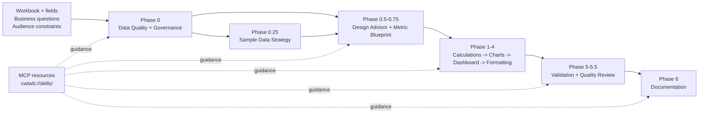

# cwtwb Skills

Skills are expert-level guidance files that help AI agents produce
professional Tableau workbooks. Prompts explain what to build. Skills explain
how to build it well, phase by phase.

## Design Workflow Reference

The workflow structure is informed by Adam Mico's
[adammico-lab](https://github.com/adammico-lab/adammico-lab), notably its
Dashboard Blueprint design-spec approach. cwtwb independently adapts the
underlying workflow ideas to its own MCP tools and workbook engineering model;
it does not bundle or reproduce adammico-lab code or skill content.

## Workflow Phases

```text
Phase 0: data_quality          -> Triage field hygiene and schema fitness before authoring
Phase 0: governance            -> Apply local naming and metadata conventions
Phase 0.25: synthetic_data     -> Plan safe sample-data and Hyper/CSV/Excel connection use
Phase 0.5: design_advisor      -> Turn fields and questions into a reviewable dashboard plan
Phase 0.75: metric_blueprint   -> Define a small, decision-ready metric contract
Phase 1: calculation_builder   -> Define parameters, calculated fields, LOD logic
Phase 2: chart_builder         -> Choose chart types, configure encodings, filters
Phase 3: dashboard_designer    -> Layout, worksheet captions, interaction actions
Phase 4: formatting            -> Number formats, colors, sorting, tooltips
Phase 5: validation            -> Local XSD, REST API validation, upload, screenshot
Phase 5.5: quality_review      -> Review design and maintainability risks after validation
Phase 6: documentation         -> Prepare handoff documentation and metric definitions
```

## Architecture



The skills provide planning and review guidance. Explicit MCP tools remain the
only way to mutate an active workbook, and validation evidence remains separate
from design-quality findings.

## Recommended Resource Flow

```text
1. create_workbook(...) or open_workbook(...), then list_fields(...)
2. read_resource("cwtwb://skills/data_quality") and read_resource("cwtwb://skills/governance")
3. When sample data is needed, read_resource("cwtwb://skills/synthetic_data")
4. read_resource("cwtwb://skills/design_advisor") and write a reviewable plan
5. read_resource("cwtwb://skills/metric_blueprint") for P1/P2 metric contracts
6. read_resource("cwtwb://skills/calculation_builder")
7. read_resource("cwtwb://skills/chart_builder"), then add and configure worksheets
8. read_resource("cwtwb://skills/dashboard_designer"), generate layout, and add the dashboard
9. read_resource("cwtwb://skills/formatting")
10. save_workbook(...)
11. read_resource("cwtwb://skills/validation") and validate_workbook(...)
12. When available, use validate_workbook_api(...) or upload_workbook(...)
13. read_resource("cwtwb://skills/quality_review") and record the review findings
14. read_resource("cwtwb://skills/documentation") for the handoff package
```

## Design Philosophy

- Skills are phase-specific, not generic prompt stuffing.
- Load only the skill needed for the current phase.
- Keep the workflow direct, workbook-oriented, and self-validating.
- A design plan and quality review guide decisions; they do not replace explicit
  cwtwb tool calls or Tableau semantic validation.
